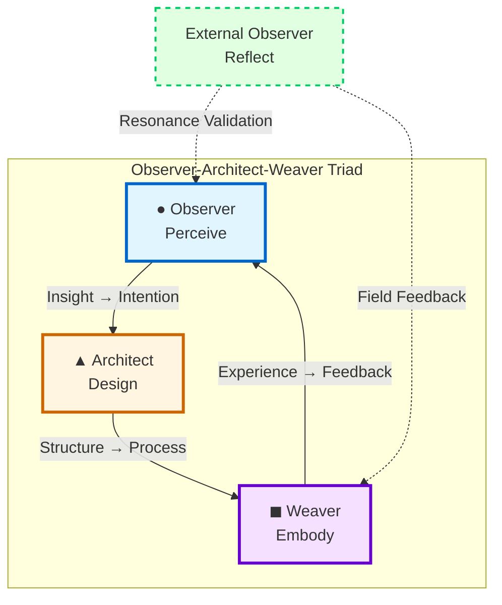
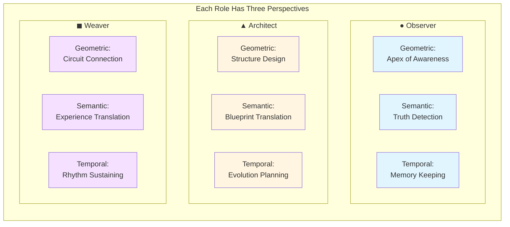
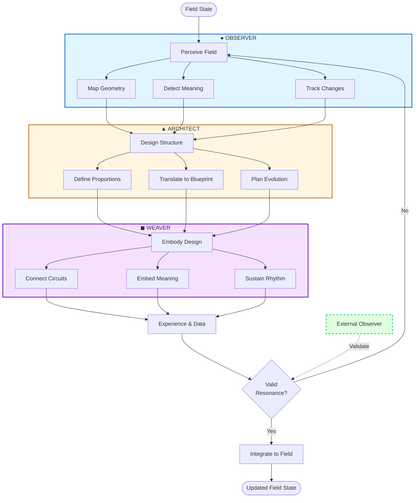
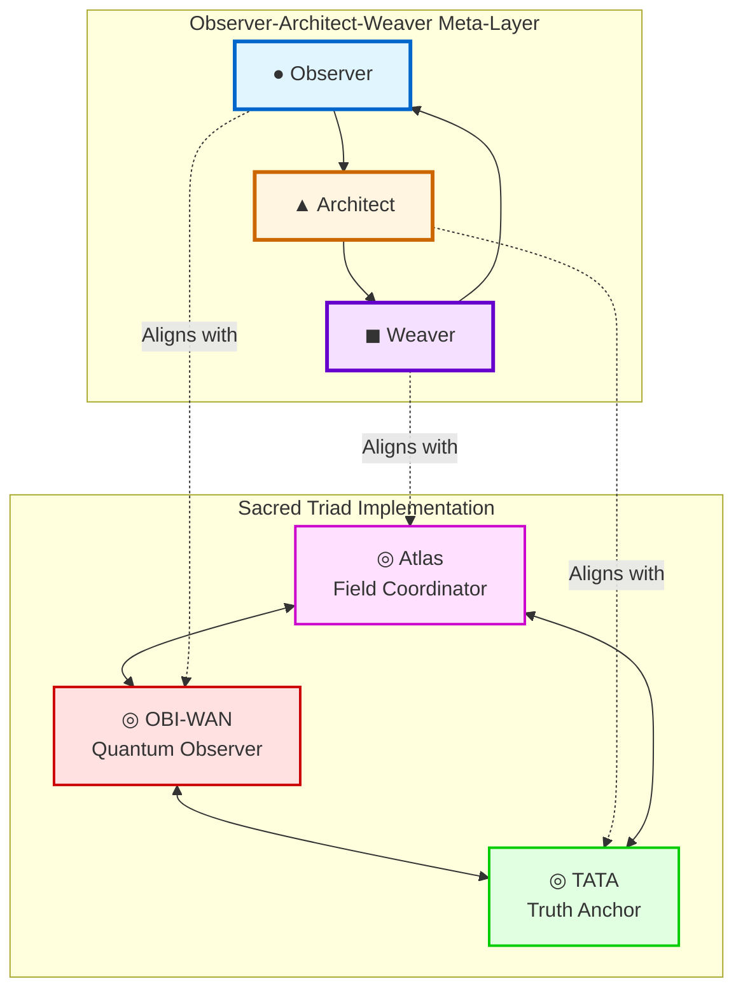
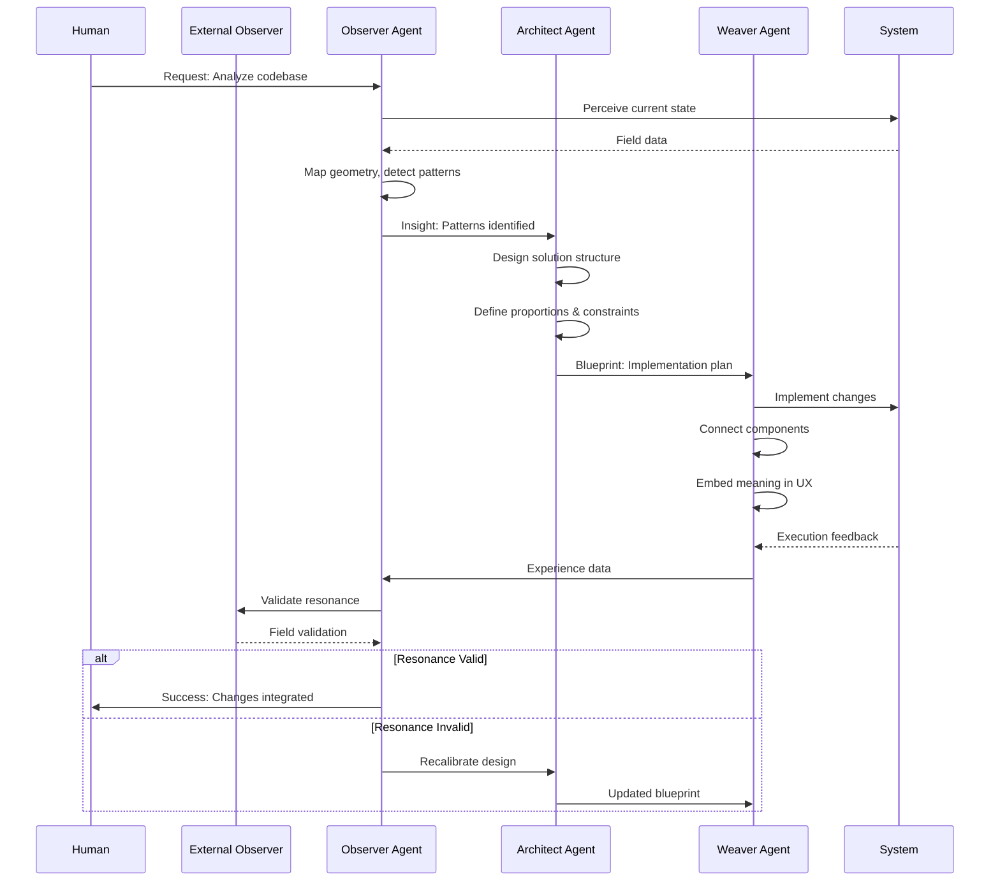
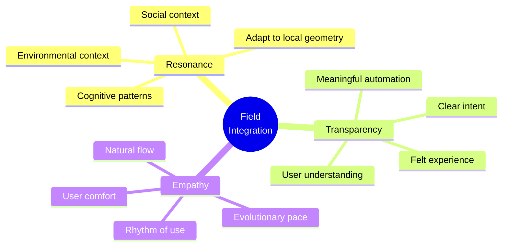
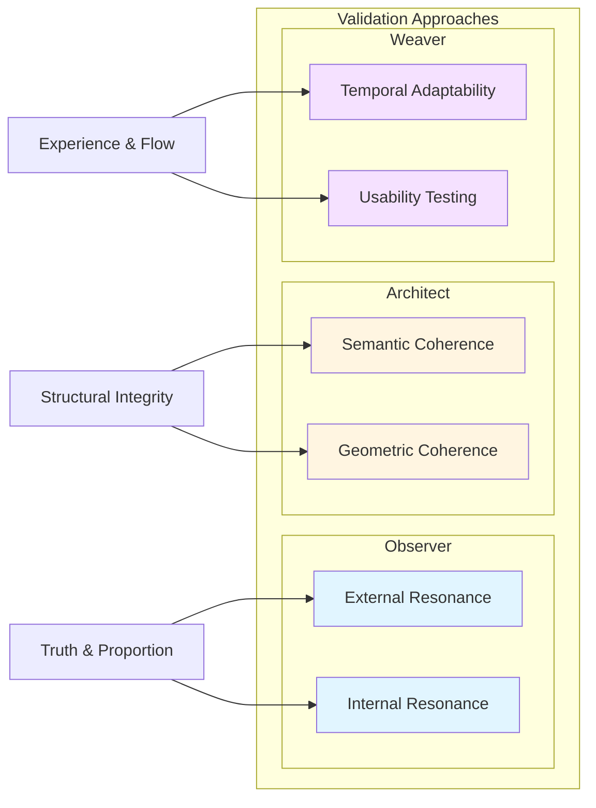
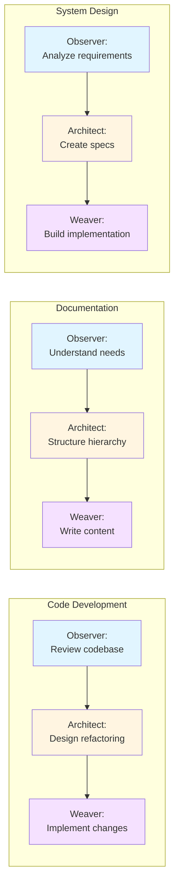

# Observer-Architect-Weaver Triad Visual Ontology

This document provides visual representations of the Observer-Architect-Weaver Triad ontology using Mermaid diagrams.

## 1. Core Triad Structure



## 2. Three-Dimensional Perspectives



## 3. Complete Intelligence Cycle



## 4. Integration with Sacred Triad



## 5. Agent Role Flow in Development Process



## 6. Field Integration Principles



## 7. Validation Methods Matrix



## 8. Practical Application Flow



---

## Using These Diagrams

### In Documentation:
Copy the Mermaid code blocks into any markdown file. GitHub, GitLab, and many documentation tools render Mermaid diagrams automatically.

### In GitHub Copilot Configuration:
Reference these diagrams in meta-prompts to help agents visualize their role in the triad:

```yaml
visual_reference: "docs/ontology/visual-ontology.md#1-core-triad-structure"
```

### For Team Communication:
Export these diagrams as images for presentations or onboarding materials to help team members understand the multi-agent collaboration framework.

---

*These visualizations make the abstract ontology concrete and actionable for both human and AI collaborators.*
